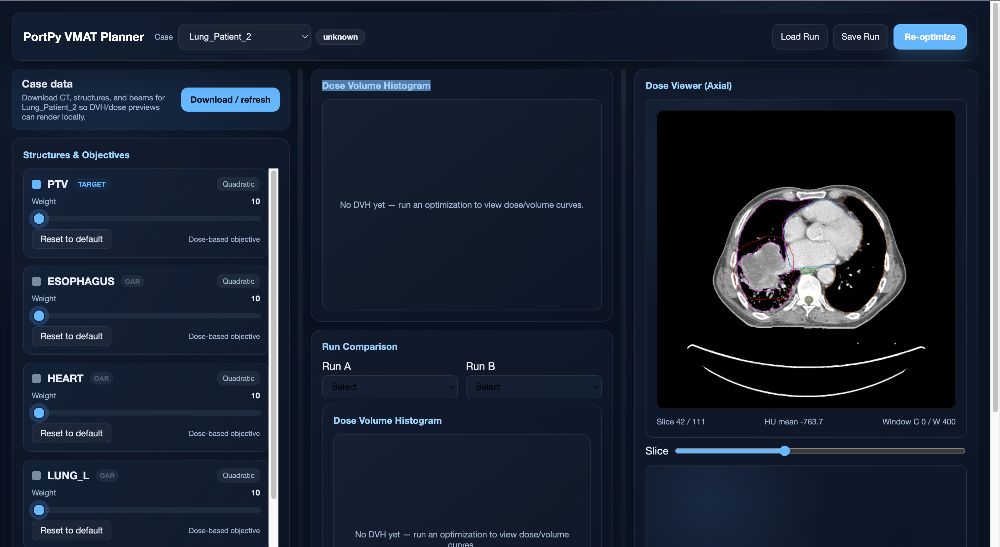

# TJU PortPy VMAT Demo

A research demo that wraps the PortPy VMAT global optimal example in a FastAPI backend and a modern, Eclipse-inspired web UI. It lets you:

- Download PortPy benchmark patients (via Hugging Face) on demand
- Run the VMAT global optimal example programmatically (MOSEK/ECOS_BB)
- View DVHs, key dose metrics, and axial dose/contour slices
- Adjust objective weights/targets and compare runs side by side
- Stream solver logs/progress (MOSEK/ECOS) and check solver health/license

> ⚠️ Research only. No clinical use. PortPy is licensed for non-commercial academic/research purposes.

## Screenshots

Web UI (dark theme):



Backend + download flow:


## Project structure

- `services/api/app/` — FastAPI backend
  - `main.py` — API endpoints (`/cases`, `/ensure_patient/{id}`, `/optimize`, `/runs/{id}`, `/cases/{id}/ct_slice/{slice}`, `/health/solver`)
  - `download_patient.py` — Fetch a single patient folder from Hugging Face if missing
  - `portpy_runner/vmat_global_optimal_runner.py` — Notebook-faithful VMAT runner
  - `storage.py` — File-based run artifacts
- `web/` — Next.js 14 UI
  - Draggable panels, DVH, metrics, axial dose viewer with contour overlays
  - React Query for API calls
- `IMPLEMENTATION_PLAN.md` — Work plan and checklist

## Quick start

Prereqs: Python 3.9+, Node 18+, MOSEK (optional but recommended for speed), git, curl.

### Backend
```bash
python3 -m venv portpy-vmat-env
source portpy-vmat-env/bin/activate
pip install -r PortPy-master/requirements.txt
pip install fastapi uvicorn python-dotenv pillow scipy "numpy<2"

# (optional) set HF token for faster downloads and MOSEK license path
echo "HF_TOKEN=your_token" >> .env
echo "MOSEKLM_LICENSE_FILE=/absolute/path/to/.mosek/mosek.lic" >> .env

uvicorn services.api.app.main:app --reload --port 8000
```

### Frontend
```bash
cd web
npm install
echo "NEXT_PUBLIC_API_BASE=http://localhost:8000" > .env.local
npm run dev
```
Open http://localhost:3000.

### Downloading patients
- Click “Download / refresh” in the UI for the selected case, or call:
  ```bash
  curl -X POST http://localhost:8000/ensure_patient/Lung_Patient_6
  ```
- Backend logs will show progress; data is saved under `PortPy-master/data/<patient>`.

### Running optimization
- In the UI, adjust objectives and click “Re-optimize.” The backend runs the VMAT global optimal example and returns DVH/metrics/dose for visualization and comparison.
- Watch the solver console/progress charts for gap/objective/runtime; the elapsed timer stops when the run finishes.
- Use the dose threshold slider in the CT viewer to focus the isodose wash.

### MOSEK health check
- Backend endpoint: `GET /health/solver` reports import/license status (fails open to ECOS_BB otherwise).

## Current status (from implementation plan)
- [x] Runner: Notebook-faithful VMAT runner (defaults, overrides, DVH/metrics, MIP deliverability).
- [x] Objective schema/adapter: Defaults from PortPy configs; overrides applied. (Tighten validation/error surfacing.)
- [x] Storage: File-based run artifacts (JSON + npz).
- [x] Backend: FastAPI endpoints (`/cases`, `/ensure_patient`, `/optimize`, `/runs`, `/cases/{id}/ct_slice/{slice}` with contour overlays). (Improve logging/error handling.)
- [x] UI: Next.js dark UI with draggable panels, objectives controls, DVH, metrics, axial dose viewer (contours), run comparison, download/refresh. (Polish DVH axes, Eclipse-like objectives controls, richer job status.)
- [ ] Validation: Add automated smoke/tests.
- [ ] UX: Better download progress, status/error messaging, MOSEK speed guidance.

## Notes on data and licensing
- Patient data are **not** in the repo. They are pulled from [PortPy-Project/PortPy_Dataset](https://huggingface.co/datasets/PortPy-Project/PortPy_Dataset) via the downloader.
- PortPy is licensed for non-commercial academic/research use under Apache 2.0 with Commons Clause (see [PortPy LICENSE](https://github.com/PortPy-Project/PortPy/blob/master/LICENSE.txt)).
- MOSEK requires a valid license for performant solves.

## Credits
- **PortPy**: VMAT algorithms, data, and reference notebooks — https://github.com/PortPy-Project/PortPy
- **ECHO-VMAT**: Architectural inspiration for VMAT abstractions — https://github.com/PortPy-Project/ECHO-VMAT

## Repository housekeeping

`.gitignore` excludes envs, node_modules, build artifacts, and all patient data/metadata. Keep secrets (e.g., `HF_TOKEN`) in an untracked `.env`.
